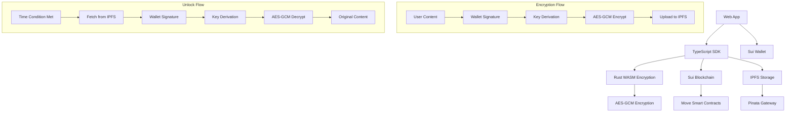

# 🕰️ Decentralized Time Capsule

A decentralized time capsule system built on Sui blockchain that allows users to encrypt and store content with blockchain-enforced time locks. Store your memories, messages, and data securely with cryptographic guarantees.

[](https://opensource.org/licenses/MIT)
[](https://www.typescriptlang.org/)
[](https://www.rust-lang.org/)
[](https://sui.io/)

## ✨ Features

- **⏰ Time-based Capsules**: Lock content until a specific date and time with blockchain enforcement
- **🔐 Wallet-based Encryption**: No passwords needed - your wallet signature is your key
- **🌐 Decentralized Storage**: Content stored on IPFS via Pinata for permanent availability
- **🔒 Strong Encryption**: AES-GCM encryption with Rust WASM for maximum security
- **📱 Mobile-First Design**: Responsive web app optimized for all devices
- **⚡ Performance Optimized**: RAF-based rendering for smooth UI with many capsules
- **🛠️ Developer Friendly**: TypeScript SDK and CLI tools for easy integration

## Project Structure

```plaintext
├── contracts/          # Sui Move smart contracts
│   └── time_capsule/   # Main capsule contract
├── rust/               # Rust workspace
│   ├── encryptor-wasi/ # WASM encryption module
│   └── cli-tool/       # CLI application
├── packages/           # TypeScript packages
│   ├── sdk/           # TypeScript SDK
│   └── types/         # Shared type definitions
└── apps/              # Applications
    └── web/           # Next.js web application
```

## Getting Started

### Prerequisites

- **Node.js** 18+ ([Download](https://nodejs.org/))
- **pnpm** 8+ (required - npm/yarn/bun not supported)
- **Rust** 1.70+ ([Install](https://rustup.rs/))
- **Git** (for submodules)
- **Sui Wallet** ([Sui Wallet Extension](https://chrome.google.com/webstore/detail/sui-wallet/opcgpfmipidbgpenhmajoajpbobppdil))

### Quick Start

1. **Clone the repository**:

```bash
git clone --recursive https://github.com/your-username/decentralized-time-capsule.git
cd decentralized-time-capsule
```

2. **Install pnpm** (if not already installed):

```bash
npm install -g pnpm
```

3. **Install dependencies**:

```bash
pnpm install
```

> ⚠️ **Important**: This project requires pnpm. Installation will fail with npm/yarn/bun.

4. **Build the project**:

```bash
# Build Rust WASM modules
cd rust/encryptor-wasi
cargo build --target wasm32-wasi --release

# Build TypeScript packages
cd ../..
pnpm build
```

5. **Set up environment variables**:

```bash
# Copy template and fill in your values
cp apps/web/.env.template apps/web/.env.local
```

6. **Configure your environment**:
   - Get Pinata API keys from [Pinata Cloud](https://app.pinata.cloud/keys)
   - Update `apps/web/.env.local` with your keys
   - Deploy contracts or use existing testnet deployment

### Environment Setup

Create `apps/web/.env.local` from the template:

```bash
# Pinata IPFS Configuration
NEXT_PUBLIC_PINATA_JWT=your-pinata-jwt-here
NEXT_PUBLIC_PINATA_GATEWAY=https://gateway.pinata.cloud

# Sui Network Configuration
NEXT_PUBLIC_SUI_NETWORK=testnet
NEXT_PUBLIC_SUI_RPC_URL=https://fullnode.testnet.sui.io:443
NEXT_PUBLIC_PACKAGE_ID=your-deployed-package-id
```

### Development

1. **Start the development server**:

```bash
pnpm dev
```

2. **Open your browser**:

   - Navigate to `http://localhost:3000`
   - Connect your Sui wallet
   - Start creating time capsules!

3. **Development commands**:

```bash
# Start web app in development mode
pnpm dev

# Build for production
pnpm build

# Run tests
pnpm test

# Lint code
pnpm lint

# Type check
pnpm type-check
```

### Testing

Run tests across all packages:

```bash
# Run all tests
pnpm test

# Run specific package tests
pnpm --filter @time-capsule/sdk test
pnpm --filter web test

# Run with coverage
pnpm test:coverage
```

## Usage

### CLI Tool

Create a time-based capsule:

```bash
cargo run --bin capsule create --file ./secret.txt --unlock-time 1735689600000
```

List your capsules:

```bash
cargo run --bin capsule list
```

Unlock a capsule:

```bash
cargo run --bin capsule unlock <capsule-id>
```

### Web Application

1. Connect your Sui wallet
2. Upload content and set unlock conditions
3. Pay transaction fees to create the capsule
4. Share the capsule ID with intended recipients
5. Unlock when conditions are met

### TypeScript SDK

```typescript
import { CapsuleSDK } from "@time-capsule/sdk";

// Initialize SDK
const sdk = new CapsuleSDK({
  network: "testnet",
  rpcUrl: "https://fullnode.testnet.sui.io:443",
});

// Create a time capsule
const content = new TextEncoder().encode("Hello, future!");
const unlockTime = Date.now() + 24 * 60 * 60 * 1000; // 24 hours from now

const result = await sdk.createTimeCapsuleWithWallet(
  content,
  unlockTime,
  walletAddress,
  signTransaction
);

console.log(`Capsule created: ${result.capsuleId}`);

// List user's capsules
const capsules = await sdk.getUserCapsules(walletAddress);

// Unlock a capsule (when time condition is met)
const unlocked = await sdk.unlockCapsule(capsuleId, walletAddress);
const decrypted = await sdk.decryptContentWithWallet(
  unlocked.encryptedContent,
  unlocked.nonce,
  walletAddress,
  capsuleId,
  unlockTime,
  unlocked.salt
);

console.log(new TextDecoder().decode(decrypted.content));
```

### Advanced Usage

```typescript
// Create capsule with file upload to IPFS
const fileContent = await fs.readFile("secret-document.pdf");
const result = await sdk.createCapsuleWithIPFS(
  fileContent,
  unlockTime,
  walletAddress,
  {
    pinataJWT: process.env.PINATA_JWT,
    metadata: {
      name: "Secret Document",
      description: "Important document for future reference",
    },
  }
);

// Batch operations
const multipleCapsules = await Promise.all([
  sdk.createTimeCapsuleWithWallet(content1, time1, wallet, sign),
  sdk.createTimeCapsuleWithWallet(content2, time2, wallet, sign),
  sdk.createTimeCapsuleWithWallet(content3, time3, wallet, sign),
]);

// Monitor capsule status
const status = await sdk.getCapsuleStatus(capsuleId);
console.log(
  `Capsule ${capsuleId} is ${status.unlocked ? "unlocked" : "locked"}`
);
```

## 🏗️ Technical Architecture



### System Layers

1. **🎨 Frontend Layer**

   - Next.js 14 with TypeScript
   - Mobile-first responsive design
   - Sui wallet integration
   - Real-time progress tracking

2. **🔐 Encryption Layer**

   - Rust WASM modules for performance
   - AES-GCM encryption with wallet-derived keys
   - No password storage required
   - Cryptographically secure key derivation

3. **⛓️ Blockchain Layer**

   - Sui Move smart contracts
   - Time-lock enforcement
   - Immutable metadata storage
   - Gas-efficient operations

4. **🌐 Storage Layer**

   - IPFS distributed storage
   - Pinata gateway for reliability
   - Content addressing for integrity
   - Permanent availability

5. **🛠️ SDK Layer**
   - TypeScript SDK for developers
   - CLI tools for automation
   - Cross-platform compatibility
   - Comprehensive API coverage

## Security

- Content is encrypted using XChaCha20-Poly1305 before storage
- Encryption keys are generated using cryptographically secure random number generators
- Content integrity is verified using BLAKE3 hashes
- Smart contracts enforce unlock conditions on-chain

## 🚀 Deployment

### Deploy Smart Contracts

1. **Install Sui CLI**:

```bash
cargo install --locked --git https://github.com/MystenLabs/sui.git --branch devnet sui
```

2. **Deploy to testnet**:

```bash
cd contracts
sui client publish --gas-budget 100000000
```

3. **Update environment variables** with the deployed package ID.

### Deploy Web App

#### Vercel (Recommended)

1. Fork this repository
2. Connect to Vercel
3. Set environment variables in Vercel dashboard
4. Deploy automatically on push

#### Docker

```bash
# Build Docker image
docker build -t time-capsule-web ./apps/web

# Run container
docker run -p 3000:3000 --env-file .env.local time-capsule-web
```

## 📚 API Reference

### SDK Methods

#### Core Methods

```typescript
// Create time capsule
createTimeCapsuleWithWallet(
  content: Uint8Array,
  unlockTime: number,
  walletAddress: string,
  signTransaction: Function
): Promise<CapsuleResult>

// Get user's capsules
getUserCapsules(walletAddress: string): Promise<Capsule[]>

// Get capsule by ID
getCapsuleById(capsuleId: string): Promise<Capsule>

// Decrypt content
decryptContentWithWallet(
  encryptedContent: Uint8Array,
  nonce: Uint8Array,
  walletAddress: string,
  capsuleId: string,
  unlockTime: number,
  salt: Uint8Array
): Promise<DecryptionResult>
```

#### Utility Methods

```typescript
// Check if capsule can be unlocked
canUnlock(capsule: Capsule): boolean

// Format time remaining
getTimeRemaining(unlockTime: number): string

// Validate capsule data
validateCapsule(capsule: Capsule): boolean
```

## 🔧 Troubleshooting

### Common Issues

**1. "Failed to load WASM module"**

```bash
# Rebuild WASM modules
cd rust/encryptor-wasi
cargo build --target wasm32-wasi --release
```

**2. "Pinata upload failed"**

- Check your Pinata JWT token
- Verify network connectivity
- Ensure sufficient Pinata storage quota

**3. "Transaction failed"**

- Check wallet balance (need SUI for gas)
- Verify network connection
- Try with higher gas budget

**4. "Capsule not found"**

- Verify capsule ID is correct
- Check if capsule exists on current network
- Ensure wallet has access permissions

### Debug Mode

Enable debug logging:

```bash
# Set debug environment
export DEBUG=time-capsule:*

# Run with verbose logging
pnpm dev --verbose
```

## 🤝 Contributing

We welcome contributions! Please follow these steps:

### Development Setup

1. **Fork and clone**:

```bash
git clone https://github.com/your-username/decentralized-time-capsule.git
cd decentralized-time-capsule
```

2. **Create feature branch**:

```bash
git checkout -b feature/amazing-feature
```

3. **Make changes and test**:

```bash
pnpm test
pnpm lint
pnpm type-check
```

4. **Commit with conventional commits**:

```bash
git commit -m "feat: add amazing feature"
```

5. **Push and create PR**:

```bash
git push origin feature/amazing-feature
```

### Code Style

- Use TypeScript for all new code
- Follow existing code patterns
- Add tests for new features
- Update documentation
- Use conventional commit messages

### Testing

```bash
# Run all tests
pnpm test

# Run specific tests
pnpm test -- --grep "encryption"

# Run with coverage
pnpm test:coverage
```

## 📄 License

This project is licensed under the MIT License - see the [LICENSE](LICENSE) file for details.

## 🙏 Acknowledgments

- [Sui Foundation](https://sui.io/) for the blockchain infrastructure
- [IPFS](https://ipfs.io/) and [Pinata](https://pinata.cloud/) for decentralized storage
- [Rust](https://www.rust-lang.org/) and [WebAssembly](https://webassembly.org/) communities
- Logo design by [@damesck233](https://github.com/damesck233) - Beautiful time capsule logo design
- All contributors and testers

## 📞 Support

- 📧 Email: <support@timecapsule.example>
- 💬 Discord: [Join our community](https://discord.gg/timecapsule)
- 🐛 Issues: [GitHub Issues](https://github.com/your-username/decentralized-time-capsule/issues)
- 📖 Docs: [Documentation](https://docs.timecapsule.example)
